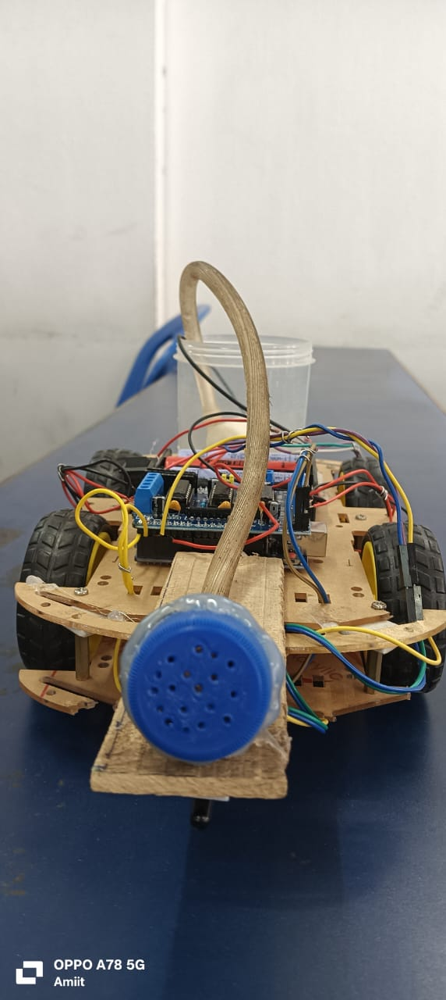
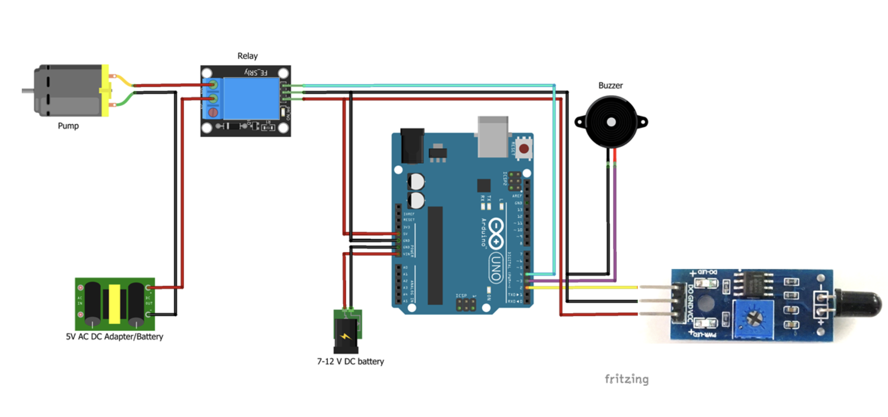
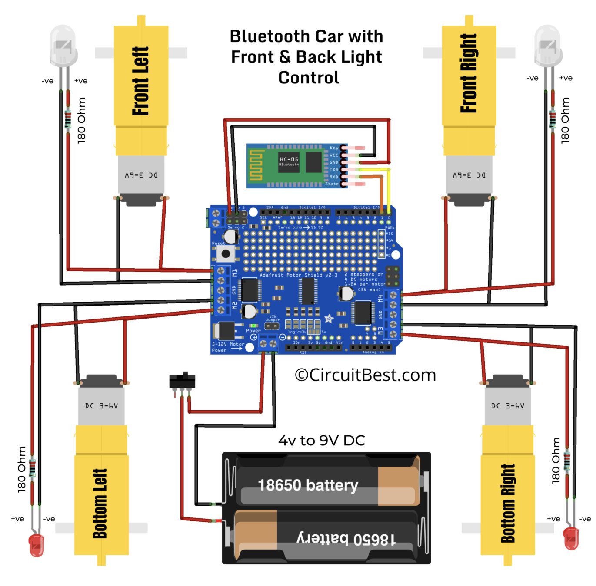

# Fire Detection & Extinguisher Robot

<h3>4th Semester Minor Project</h3>

In today's world, fire hazards pose significant threats to life and property, making early detection and rapid response crucial. This project presents a Fire Detection and Extinguishing Robot, designed using an Arduino Uno and controlled via Bluetooth. The robot is equipped with a fire sensor to detect flames, and a water pump mechanism to extinguish small fires. Mobility is achieved through TT motors driven by an L293D motor driver, and a Bluetooth module allows wireless control through a smartphone. This system is a cost-effective and efficient solution aimed at assisting in fire emergencies, especially in areas inaccessible or dangerous for humans.

<h2>Components used</h2>

1. Arduino UNO microcontroller

2. L293D Motor Driver

3. 4 x TT Motors

4. HC-05 Bluetooth Module

5. Flame Sensor

6. Pumping motor

7. 3 x Lithium Ion Batteries

8. Battery case

9. Switch

10. Jumper Wires

11. Relay Module

<h2>Circuit Diagrams</h2>

1. Fire detection Circuit

   

2. Bluetooth Control Circuit

   

<h2>Team Members</h2>

1. Ansubha Dhar (83) - Leader

2. Amit Debnath (78)

3. Anushka Lahiri (84)

4. Manoj Ghosh (105)

5. Saugnik Aich (112)

 

This project is presented at SIMULCRUM 2025, organised jointly by IEM IEI student chapter & IEEE IAS SBC from IEM, Kolkata on 11th April, 2025

